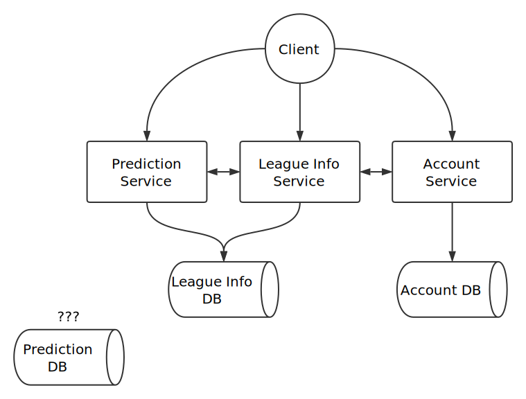

# BigSix Proposal

### Purpose

Aside from mainstream professional sports leagues such as the Big Five football leagues or NBA , normal sports lovers also have their own amateur leagues and hold matches. In cases that I've encountered, we just keep the data records of matches(score, ranking, etc.) in text files so it's actually invisible to public, if the members of the league have the intention to scale up its size and influence, we must fix this invisibility. So our project focuses on building a platform which user can create their own league and upload related data and make it public. In this way they can have more approaches to help their league evolve. Just like the slogan of our project, make your own league another La Liga.

### Scope

- **Simple User System**

  The user system of this project shall be as simple as possible because it has nothing to do with our main function. In the most ideal case there will be no system administrator accounts, only users with the authority to create leagues or collaborate on updating them. From this point of view, you can also consider all users as administrators of leagues.

- **Various Match Record Formats**

  The data records of different kind of matches comes in multiple formats. For sports like Basketball or football we only have to keep records of the final score of each team. But for sports like badminton or ping pong we also have to keep records of the score of each set. Not to mention golf, where the results of the a stroke-play match involves both ranking and stroke counts. So when uploading records of different kinds of matches, we may provide different template and use XSLT to parse them.

- **Various Prediction Type**

  For results prediction, we referenced from China Sports Lottery. Apart from simple prediction on winning or losing, concepts like handicap are also included. We may use frontend DSL to present all predictions as different matches have different kind of predictions.

- **Data granularity**

  We'll initiate our project data granularity at the level of matches and teams, which means we don't have concepts as players, injuries or transfers. For this part I referenced from the question C of 2018 Tongji MCM, it's a question about predicting the final rankings of 2018 CSL by the performance showed by all the teams after first eight rounds. And the question also ignored stuff like transfer or injuries.

### Main Functionalities

- **Match Records Upload**
- **Data Visualization**
- **Result Prediction**

### Preliminary Logical Architechture

- Backend: Spring Boot

- Database: PostgreSQL

- Frontend: Vue.js

- **Micro Service Architecture**

  